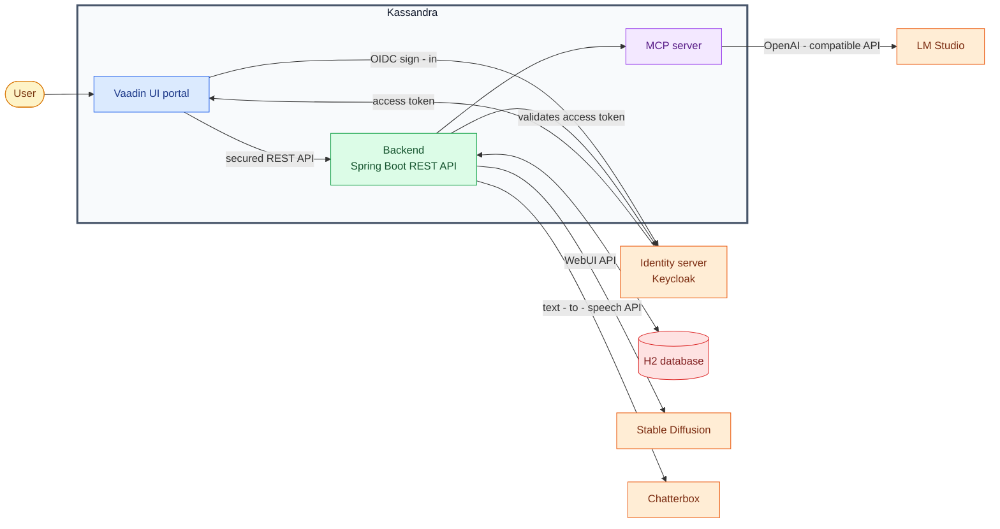

[](https://github.com/kunterbunt2/project-hub/blob/main/LICENSE)
[](https://github.com/kunterbunt2/project-hub/actions/workflows/maven-build.yml)
[](https://codecov.io/github/kunterbunt2/project-hub)

# kassandra

Tiny project management server.<br>
Project effort estimation and progress tracking and release date interpolation open source server.

see [Kassandra presentation](https://abdallabushnaq.github.io/kassandra/#/s1)

## Try the demo

Run the self-contained Kassandra and Keycloak demo:

```bash
docker compose -f docker-compose.demo.yml up
```

Open [http://localhost:8080/ui/](http://localhost:8080/ui/) and sign in with **demo** / **demo**. The demo restores a
curated, disposable data snapshot on its first start and retains changes in its Docker volume. The public demo image is
pulled automatically; no GitHub Packages credentials are required.

## Architecture

Kassandra is **API first**: the Vaadin portal is a client of the same secured REST API that integrations and the AI
assistant use. This keeps the business capabilities available beyond the UI and makes every API operation independently
testable and reusable.



### AI assistant and MCP server

The MCP server is part of the Kassandra backend. It gives the language model a controlled set of project-management
tools, while those tools call Kassandra's own secured REST API rather than bypassing its authorization rules or
accessing the database directly. See the [MCP design](https://github.com/abdallabushnaq/kassandra/wiki/mcp-design) for
the detailed interaction flow.

# What makes Kassandra different?

1. Self-sufficient project planning and progress tracking in one tiny server.
2. Minimum and maximum effort estimation guardrail the project execution.
3. Release date interpolation based on the estimation and progress of the project.

## Notice

- for the agent tests to run, you need to load ministral-3-8B with 20480 token context and a sed of 42.

## Server settings

Administrators manage runtime server settings from **Manage Settings** in the user menu. Kassandra stores those values
in
its database, validates each value against its documented type and limits, and applies supported AI and Stable Diffusion
settings immediately. Settings that require a Spring-managed client restart are labelled accordingly.

Database connection, server, and security bootstrap settings remain deployment-managed. Set
`KASSANDRA_SECURITY_ENCRYPTION_KEY` when storing a credential through the UI; it is the external AES-256 master key used
to encrypt persisted secrets, which are never returned to the browser after saving.

## features

tbd

[Requirements](https://github.com/kunterbunt2/project-hub/wiki/Requirements)

[Limitations](https://github.com/kunterbunt2/project-hub/wiki/Limitations)

[Design](https://github.com/kunterbunt2/project-hub/wiki/Design)

[entity-relationship-diagram](https://github.com/kunterbunt2/project-hub/wiki/entity-relationship-diagram)

# Roadmap

## Phase 1 (minimum viable specs)

1. ✅ Authentication via oidc
2. ✅ Product crud
3. ✅ Version crud
4. ✅ Feature crud
5. ✅ Sprint crud
6. ✅ User crud
7. ✅ User groups crud
8. ✅ Task crud
9. ✅ worklog crud
10. ✅ User availability time-frames
11. ✅ User location time-frames
12. ✅ User work week time-frames
13. ❌ Project work week time-frames (for tasks without a resource assigned)
14. ✅ National Holidays
15. ✅ vacations
16. ✅ sick leaves
17. ✅ Authorization, access control using user groups on project level.
18. ✅ Gantt chart
19. ✅ Automatic Gantt buffer calculation
20. ✅ Burn down chart
21. ✅ Close project Release Date.
22. ✅ Dialog should set curser to edit box
23. ✅ Dialog confirmation button should react to return
24. ✅ add dark avatar
25. ❌ show product, versions, features, in backlog
26. ❌ show product, versions, features, in quality-board
27. ✅ show Versions, Features, Sprints pages in menu
28. ✅ add about box.
29. ✅ optimize AbstractEntityGenrator avatar generation code.
30. ✅ data scenario simulation generator
    1. ✅ Simulator Write the use case as a Story in the project or product
    2. ✅ include closed and delayed sprints.

## Phase 2 (installable version)

1. ❌ alpha release (0.1.0) of minimum viable product.
2. ✅ docker container image.
3. ✅ first initialization.
4. ❌ server settings

## Phase 3 (optimizations)

1. ❌ test should not create default user with avatar to speed up test execution.
2. ❌ unit tests should turn off stable diffusion service to speed up tests execution.
3. ❌ run ui tests in browser full screen mode.
4. ❌ gantt chart generation with resource conflict visualization.
5. ❌ gantt chart resource leveling including other projects.
6. ❌ keep number of clicks to minimum for daily work of developer.
7. ❌ Audit logs
8. ❌ lock project.
9. ❌ give project managers ways to control schedule.
10. ❌ give project managers ways to control resource leveling.
11. ❌ Admin hub
12. ❌ Performance
13. ❌ Live updates to your inputs
14. ❌ Live response to your Input.
15. ✅ product page.
16. ❌ GDPR
17. ❌ undo
18. ❌ history
19. ❌ add aura theme
20. ❌ next level of ai agent capability
    1. ❌ list problematic sprints.
    2. ❌ determine reason for the problem (e.g. estimation, resource availability, etc.).
    3. ❌ suggest developers with capacity to help out.
    4. ❌ assign tasks to these developers.

# Kassandra Introduction Videos

https://www.youtube.com/playlist?list=PL1FdjPuGzg7LDRGZeP6uQAPet1_fZePGs

1. ✅ 01 Welcome to Kassandra Introduction Video
2. ✅ 02 Managing Users in Kassandra Introduction Video
3. ✅ 03 Managing User Groups in Kassandra Introduction Video
4. ✅ 04 User Profiles in Kassandra Introduction Video
5. ✅ 05 User Off Days Introduction Video
6. ✅ 06 User Locations Introduction Video
7. ✅ 07 User Availability Introduction Video
8. ✅ 08 Work Weeks in Kassandra Introduction Video
9. ✅ 09 Kassandra Products, Versions, Features and Sprints Introduction Video
10. ✅ 10 Stories and Tasks Introduction Video
11. ✅ 11 Rearranging Stories and Tasks Introduction Video
12. ✅ 12 Story and Task Relations Introduction Video
13. ✅ 13 Logging Work Introduction Video
14. ✅ 14 Kassandra Agent Introduction Video

# Screenshots


# Design Philosophy

- As simple as possible, as complex as necessary.
- Backup the development with unit tests.
- Create data generators that can be used in unit tests.
- Written in Java + spring boot + Vaadin.
- Minimalistic project status tracking within one single server.
- Simple local database, but keep option to switch to other databases.

# What does this Project do a bit different?

1. API first. Everything is based on an api. Even the Ui is just a client of the API.
2. ErDiagramTest is an integration test that generates
   an [Entity Relationship Diagram](https://github.com/kunterbunt2/project-hub/wiki/entity-relationship-diagram).
3. GenerateScreenshots is an integration test that takes screenshots of every screen and dialog both in light and dark
   mode. All screenshots are stored in github.wiki.
   Example: [active sprints](https://github.com/kunterbunt2/project-hub/wiki/active-sprints).
4. The UI is tested using selenium,
5. All [introduction videos](https://www.youtube.com/playlist?list=PL1FdjPuGzg7LDRGZeP6uQAPet1_fZePGs) are generated
   using selenium, chatterbox and ffmpeg. Audio output is captured and fed to the frame grabber.
6. Holidays are automatically generated based on the location of the user and the national holidays of that location.
   Example: [offday-list-view](https://github.com/abdallabushnaq/kassandra/wiki/offday%E2%80%90list%E2%80%90view).
7. By simplifying some aspects of project management
   (see [Limitations](https://github.com/kunterbunt2/project-hub/wiki/Limitations)), we can automate many aspects.

# License

[Apache License, version 2.0](https://github.com/kunterbunt2/project-hub/blob/main/LICENSE)

# Future Ideas

- introduce AI summary for all projects.
- Projects can be locked for change, which will lock start/end dates and all milestones
- project priority can be changed by moving them within the list
- sprint priority can be changed by moving them within the list
