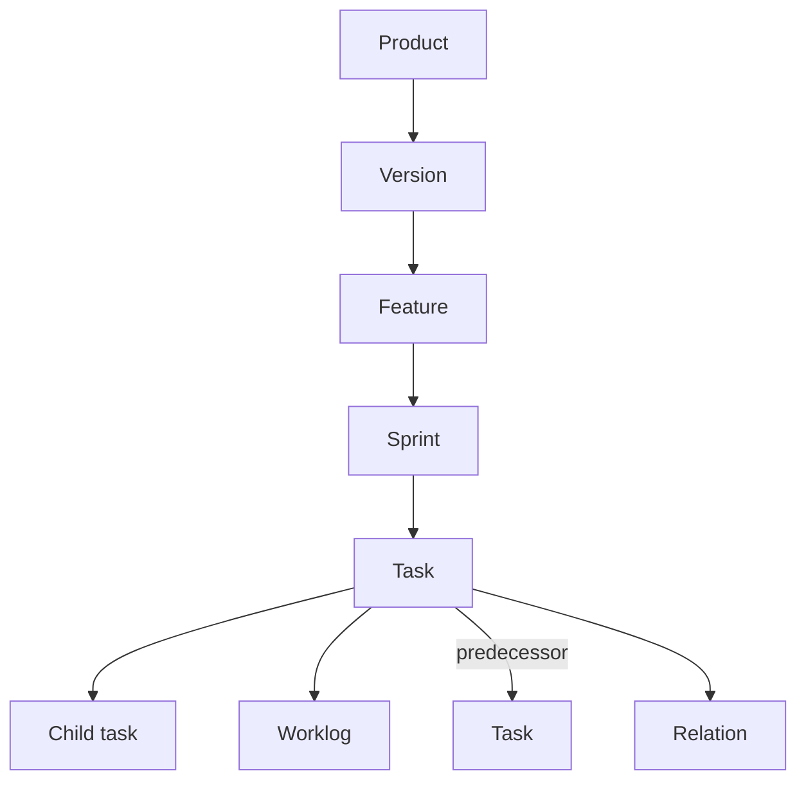
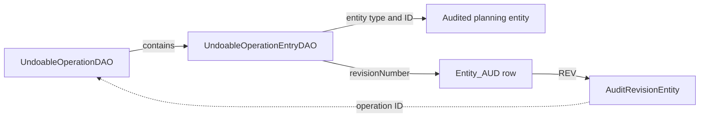
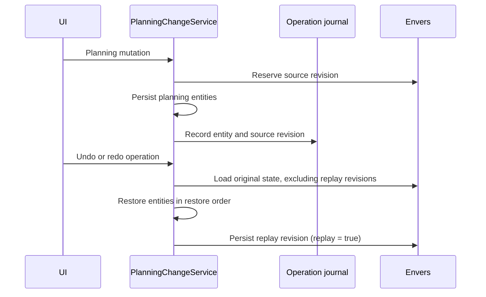

# Kassandra Design Notes

This document is a starting point for understanding the system's more involved designs. It deliberately records
responsibilities, invariants, and limitations rather than every implementation detail.
Please use embedded mermaid.js for any diagrams, and avoid screenshots or other images.

## Planning undo and redo

### Purpose

Undo/redo restores planning data after a user-visible change. It covers the planning hierarchy:

Task predecessors are planning dependencies rather than tree children. They are stored through `RelationDAO` and are
restored independently from task scalar values because Envers cannot read the restricted association audit table.

The mechanism is product-scoped and durable: history survives server restarts and can restore a soft-deleted planning
tree. Hibernate Envers is the authoritative store of planning state; the operation journal adds the user-visible
grouping, product cursor, and replay order that Envers does not provide.

### Model

`UndoableOperationDAO` is one user-visible action. Its immutable identity, actor, timestamp, product, summary, and
per-product sequence number define the history order. `undone` is the history cursor: applied operations have
`undone = false`; reverted operations have `undone = true`.

Each operation owns `UndoableOperationEntryDAO` records. An entry contains:

- the entity type and ID;
- the exact Envers revision that changed the entity;
- a restore order.

The Envers revision type identifies creation, update, and deletion. Undo loads the entity's last non-deleted state before
the entry revision; redo loads the exact entry revision. This removes duplicate JSON history while retaining
deterministic replay.

`restoreOrder` is important for trees: children are restored before their parents are removed, and parents are restored
before their children are needed again. A task-tree delete also captures updates to inbound predecessor relations.

### Write and replay flow

`PlanningChangeService` is the only owner of journal creation and replay:

1. A planning mutation reserves an Envers revision and captures references to every affected planning entity.
2. The service creates or reuses one `UndoableOperationDAO` for the resolved product and persists entries with their exact
   revision number. A UI operation spanning REST transactions therefore has multiple entry revisions.
3. Undo restores the last non-deleted Envers state before each entry revision; redo restores the exact revision state.
4. Replaying historic state first revives a soft-deleted row when necessary, then merges the restored entity state.

New mutations after an undo discard the redo branch for that product. This keeps the history linear, matching the
familiar desktop-application undo model.

The service has dedicated tree-deletion methods for task and planning roots. Do not replace these with repository
deletion calls: the journal must see every affected row, including descendants, worklogs, and relations.

Undo and redo create Envers revisions as well. `AuditRevisionEntity.replay` marks those revisions so that subsequent
replay resolves only the immutable source revisions captured by the journal.

### API and security

`UndoRedoController` exposes product-scoped undo, redo, range replay, history, and replay preview endpoints. It
delegates all state changes to `PlanningChangeService`.

The preview endpoint is the authority for the range that a selected history item affects. A request to undo or redo an
older item replays every consecutive operation required to reach that history position. Clients must never calculate
that range themselves.

All endpoints enforce product access through `AclSecurityService`; aggregate history validates access to every requested
product. Stored Envers states are never exposed by the API. `UndoRedoHistory` projects only display metadata and derived
field changes.

The aggregate history endpoint accepts a limit. The database query is paged before results are returned; clients must
not fetch and truncate history themselves. Replay preview is intentionally unbounded because confirmation must disclose
every operation that will be replayed.

The product-list view obtains its aggregate history scope from the authorized `/history/product-ids` endpoint instead
of the live product list. ACL entries remain after a product is soft-deleted, so its undone creation operation remains
visible and can be redone.

### UI flow

`MainLayout` owns the global action-history toggle and its right-side `UndoHistoryPanel`. Routed views publish their
active product scope through `setActiveProductId(s)`; views must use `MainLayout.findParent(this)` because routed
content is hosted inside a `SplitLayout`.

`UndoHistoryPanel` retrieves the bounded history and displays applied and undone operations as collapsed summaries.
Opening an operation reveals every affected entity and field, plus its explicit Undo or Redo action. This lets users
inspect large batch operations without accidentally replaying them. The action opens `UndoHistoryConfirmationDialog`
after loading the server preview.

`MainLayout` keeps the active product scope separate from the history scope. Product-specific views use the same scope
for both; the product-list view uses all authorized history product IDs so soft-deleted products remain redoable.

`UndoHistoryConfirmationDialog` shows every operation in the server-selected replay range as a collapsed summary.
Users can expand each operation to inspect all affected entities and fields; its footer is the single action that
confirms the complete range. Confirmation triggers the appropriate range endpoint, closes the panel, and reloads the
current view.

`MainLayout` caches active product DTOs and encountered actor DTOs for the Vaadin session. Avatar resolvers read that
cache only; history and preview loading warm the actor cache. This avoids a REST call for every rendered history row
while retaining hash-based avatar URLs.

### Important limitations

- History is linear **per product**. Multi-product pages aggregate entries for display, but replay always affects the
  selected operation's original product.
- Undo restores historical state, not intent. Concurrent edits to the same planning data can be overwritten by a later replay.
  Conflict detection is not implemented.
- Soft deletes are required for reversible tree deletion. Physical deletion for GDPR retention policies is a future,
  separate process and will make expired history non-replayable.
- `updateBatch(...)` currently journals every supplied entity, including unchanged entries. A completely unchanged batch
  can therefore appear in history; the UI labels it “No updates in any fields.” Avoiding all-no-op operations at write
  time is a future improvement.
- Historic relation values normalize nested IDs and collection order when deriving display field changes. This
  prevents internal relation UUID changes from being presented as planning changes.

### Where to start

| Concern                                                   | Primary class                                       |
|-----------------------------------------------------------|-----------------------------------------------------|
| Envers revision capture, tree deletion, history ordering, replay | `PlanningChangeService`, `EnversPlanningStateService` |
| Persistent operation and entry schema                     | `UndoableOperationDAO`, `UndoableOperationEntryDAO` |
| Authorized REST projection and replay endpoints           | `UndoRedoController`                                |
| REST client used by the UI                                | `UndoRedoApi`                                       |
| Global history scope, toggle, and avatar caches           | `MainLayout`                                        |
| History list and selected-operation handling              | `UndoHistoryPanel`                                  |
| Confirmation rendering for the server preview             | `UndoHistoryConfirmationDialog`                     |
